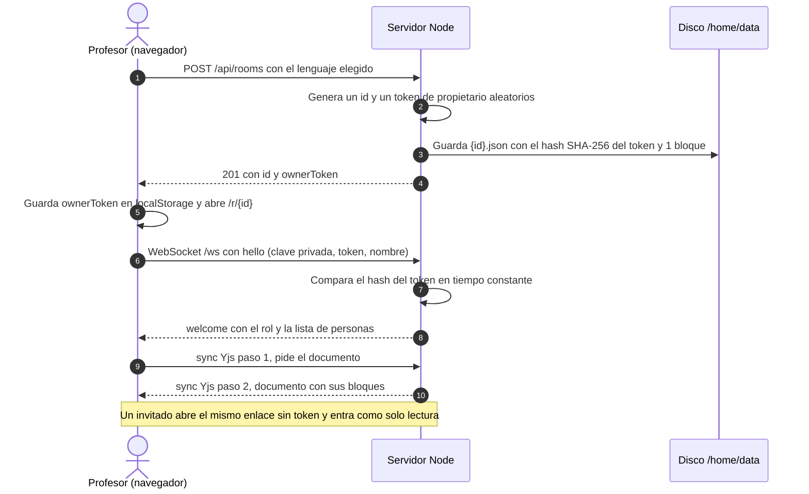
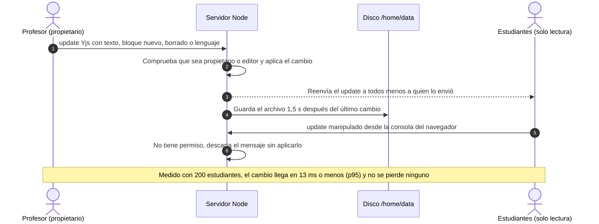
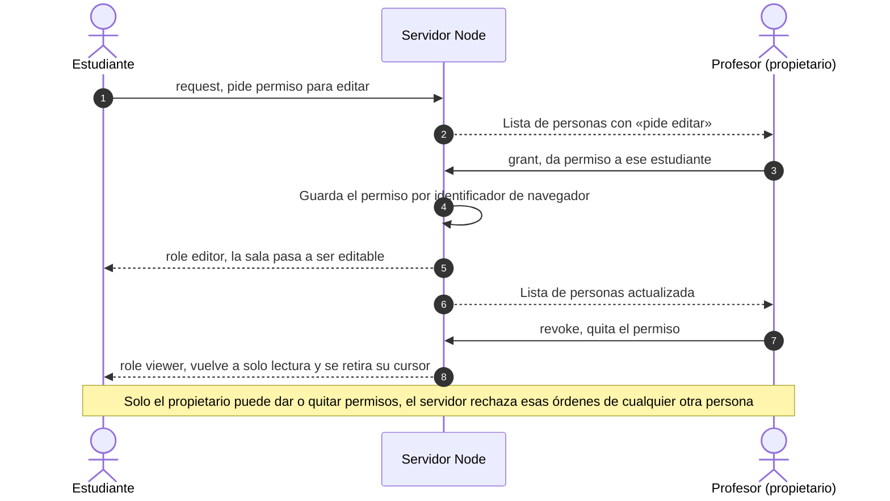
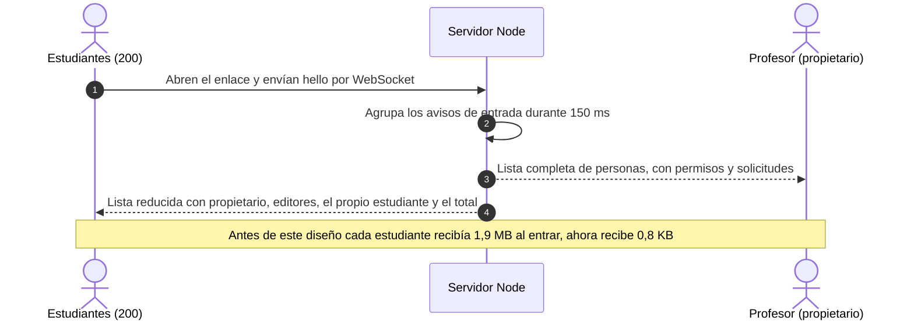

## Flujo 1 · Crear una sala y entrar

```mermaid
sequenceDiagram
  autonumber
  actor P as Profesor (navegador)
  participant S as Servidor Node
  participant D as Disco /home/data
  P->>S: POST /api/rooms con el lenguaje elegido
  S->>S: Genera un id y un token de propietario aleatorios
  S->>D: Guarda {id}.json con el hash SHA-256 del token y 1 bloque
  S-->>P: 201 con id y ownerToken
  P->>P: Guarda ownerToken en localStorage y abre /r/{id}
  P->>S: WebSocket /ws con hello (clave privada, token, nombre)
  S->>S: Compara el hash del token en tiempo constante
  S-->>P: welcome con el rol y la lista de personas
  P->>S: sync Yjs paso 1, pide el documento
  S-->>P: sync Yjs paso 2, documento con sus bloques
  Note over P,S: Un invitado abre el mismo enlace sin token y entra como solo lectura
```

## Flujo 2 · Edición en tiempo real

```mermaid
sequenceDiagram
  autonumber
  actor P as Profesor (propietario)
  participant S as Servidor Node
  participant D as Disco /home/data
  actor E as Estudiantes (solo lectura)
  P->>S: update Yjs con texto, bloque nuevo, borrado o lenguaje
  S->>S: Comprueba que sea propietario o editor y aplica el cambio
  S-->>E: Reenvía el update a todos menos a quien lo envió
  S->>D: Guarda el archivo 1,5 s después del último cambio
  E->>S: update manipulado desde la consola del navegador
  S->>S: No tiene permiso, descarta el mensaje sin aplicarlo
  Note over P,E: Medido con 200 estudiantes, el cambio llega en 13 ms o menos (p95) y no se pierde ninguno
```

## Flujo 3 · Pedir, dar y quitar permiso de edición

```mermaid
sequenceDiagram
  autonumber
  actor E as Estudiante
  participant S as Servidor Node
  actor P as Profesor (propietario)
  E->>S: request, pide permiso para editar
  S-->>P: Lista de personas con «pide editar»
  P->>S: grant, da permiso a ese estudiante
  S->>S: Guarda el permiso por identificador de navegador
  S-->>E: role editor, la sala pasa a ser editable
  S-->>P: Lista de personas actualizada
  P->>S: revoke, quita el permiso
  S-->>E: role viewer, vuelve a solo lectura y se retira su cursor
  Note over E,P: Solo el propietario puede dar o quitar permisos, el servidor rechaza esas órdenes de cualquier otra persona
```

## Flujo 4 · Entrada de una clase de 200 personas

```mermaid
sequenceDiagram
  autonumber
  actor E as Estudiantes (200)
  participant S as Servidor Node
  actor P as Profesor (propietario)
  E->>S: Abren el enlace y envían hello por WebSocket
  S->>S: Agrupa los avisos de entrada durante 150 ms
  S-->>P: Lista completa de personas, con permisos y solicitudes
  S-->>E: Lista reducida con propietario, editores, el propio estudiante y el total
  Note over E,P: Antes de este diseño cada estudiante recibía 1,9 MB al entrar, ahora recibe 0,8 KB
```
